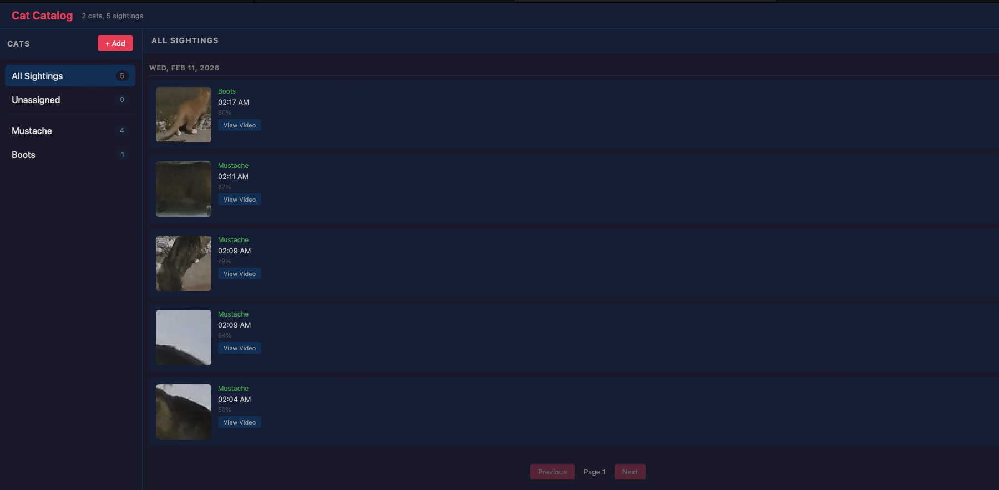

# Cat Catalog

An app to catalog the cats that come to my house.

A simple web app that ingests clips from an S3 bucket, uses machine learning to detect if a cat is in the clip, and displays the results in a web UI for a user to assign which cat is in the clip. The UI shows a history of clips and when each cat was spotted.

My wife really likes feeding stray cats.

## Getting Started

**This application is not production ready. Everything is subject to change. A reasonable amount of this project was generated by Claude Code, so there's some slop.**

Cat Catalog consists of 3 components:

1. **Detect Worker** uses OpenCV and the YOLOv8m model to look for cats in clips and adds them to the catalog. There is a CUDA-accelerated container in addition to one that uses CPU.
2. **Catalog** is the backend service that interacts with the database.
3. **Web** is the frontend service. The web UI is a static site served by nginx using only vanilla JS.

A PostgreSQL database and S3-compatible object storage are also required to use this application.

This program is designed to run using OCI containers. There is an example `docker-compose.yaml` to run Cat Catalog.
